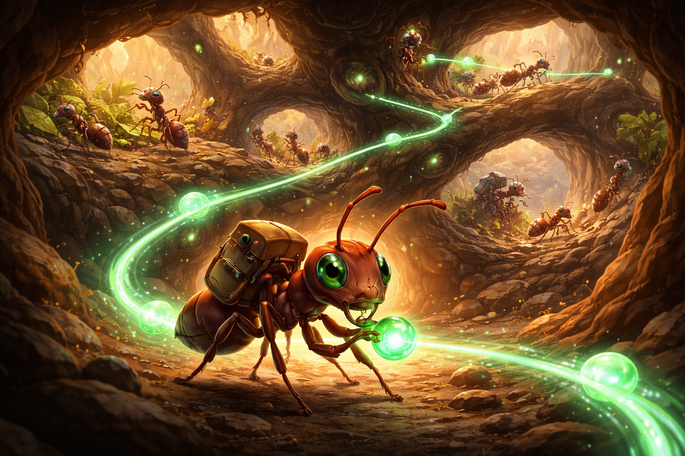

# 🐜 Phero 

**The chemical language of AI agents.**

Phero is a modern Go framework for building multi-agent AI systems. Like ants in a colony, agents in Phero cooperate, communicate, and coordinate toward shared goals, each with specialized roles, working together through a clean, composable architecture.

   

## Why Phero?

- **🎯 Purpose-built for agents** Not an LLM wrapper; a framework for orchestrating cooperative agent systems
- **🧩 Composable primitives** Small, focused packages that solve specific problems
- **🔧 Tool-first design** Built-in support for function tools, skills, RAG, and MCP
- **🎨 Developer-friendly** Clean APIs, opt-in tracing, OpenAI-compatible LLM support
- **🪶 Lightweight** No heavy dependencies; just Go and your choice of LLM provider

## Features

### Core Capabilities

- **🤝 Agent orchestration** Multi-agent workflows with role specialization and coordination
- **🧩 LLM abstraction** Work with OpenAI-compatible endpoints (OpenAI, Ollama, etc.) and Anthropic
- **🛠️ Function tools** Expose Go functions as callable tools with automatic JSON Schema generation
- **📚 RAG (Retrieval-Augmented Generation)** Built-in vector storage and semantic search
- **🧠 Skills system** Define reusable agent capabilities in `SKILL.md` files
- **🔌 MCP support** Integrate Model Context Protocol servers as agent tools
- **🧾 Memory management** Conversational context storage for agents
- **✂️ Text splitting** Document chunking for RAG workflows
- **🧬 Embeddings** Semantic search capabilities via OpenAI embeddings
- **🗄️ Vector stores** Vector database integration

### Requirements

- Go 1.25.5 or later
- An LLM provider (OpenAI / Ollama / OpenAI-compatible endpoint, or Anthropic)

## Quick Start

Start with the **[Simple Agent](examples/simple-agent/)** example to learn the basics in ~100 lines of code.

Then try:
- **[Conversational Agent](examples/conversational-agent/)** a multi-turn REPL chatbot with short-term memory
- **[Long-Term Memory](examples/long-term-memory/)** semantic (RAG) memory backed by Qdrant

Then explore the **[examples/](examples/)** directory for more advanced patterns:
- Multi-agent workflows
- RAG chatbots
- Skills integration
- MCP server connections

Some examples require extra services (e.g. Qdrant for vector search).

## Architecture

Phero is organized into focused packages, each solving a specific problem:

### 🤖 Agent Layer

- **`agent`** Core orchestration for LLM-based agents with tool execution and chat loops
- **`memory`** Conversational context management for multi-turn interactions (in-process, RAG-backed, or PostgreSQL-backed)

### 💬 LLM Layer

- **`llm`** Clean LLM interface with function tool support and JSON Schema utilities
- **`llm/openai`** OpenAI-compatible client (works with OpenAI, Ollama, and compatible endpoints)
- **`llm/anthropic`** Anthropic API client

### 🧠 Knowledge Layer

- **`embedding`** Embedding interface for semantic operations
- **`embedding/openai`** OpenAI embeddings implementation
- **`vectorstore`** Vector storage interface for similarity search
- **`vectorstore/qdrant`** Qdrant vector database integration
- **`vectorstore/psql`** PostgreSQL + pgvector integration
- **`textsplitter`** Document chunking for RAG workflows
- **`rag`** Complete RAG pipeline combining embeddings and vector stores

### 🔧 Tools & Integration

- **`skill`** Parse SKILL.md files and expose them as agent capabilities
- **`mcp`** Model Context Protocol adapter for external tool integration
- **`tool/file`** File system operations
- **`tool/go`** Safe Go command execution
- **`tool/python`** Python script execution
- **`tool/human`** Human-in-the-loop input collection

## Examples

Comprehensive examples are included in the [`examples/`](examples/) directory:

| Example | Description |
|---|---|
| [Simple Agent](examples/simple-agent/) | **Start here!** Minimal example showing one agent with one custom tool perfect for learning the basics |
| [Conversational Agent](examples/conversational-agent/) | REPL-style chatbot with short-term conversational memory and a simple built-in tool |
| [Long-Term Memory](examples/long-term-memory/) | REPL-style chatbot with semantic long-term memory (RAG) backed by Qdrant |
| [Debate Committee](examples/debate-committee/) | Multi-agent architecture where committee members debate independently and a judge synthesizes the final decision |
| [Multi-Agent Workflow](examples/multi-agent-workflow/) | Classic Plan → Execute → Analyze → Critique pattern with specialized agent roles |
| [RAG Chatbot](examples/rag-chatbot/) | Terminal chatbot with semantic search over local documents using Qdrant |
| [Skill](examples/skills/) | Discover SKILL.md files and expose them as callable agent tools |
| [MCP Integration](examples/mcp/) | Run an MCP server as a subprocess and expose its tools to agents |
| [Supervisor Blackboard](examples/supervisor-blackboard/) | Supervisor-worker pattern with a shared blackboard for coordination |

## Design Philosophy

Phero embraces several core principles:

1. **Composability over monoliths** Each package does one thing well
2. **Interfaces over implementations** Swap LLMs, vector stores, or embeddings easily
3. **Explicit over implicit** No hidden magic; clear control flow
4. **Tools are first-class** Function tools are the primary integration point
5. **Developer experience matters** Clean APIs, helpful tracing, good error messages

## Contributing

Contributions are welcome! Please feel free to submit issues, feature requests, or pull requests.

## License

This project is licensed under the Apache License 2.0. See the [LICENSE](LICENSE) file for details.

## Acknowledgments

Built with ❤️ by [Simone Vellei](https://github.com/henomis).

Inspired by the collaborative intelligence of ant colonies where independent agents work together toward shared goals, recognizing one another and coordinating through clear protocols.

**The ant is not just a mascot. It is the philosophy.** 🐜

## Links

- **Documentation**: [pkg.go.dev/github.com/henomis/phero](https://pkg.go.dev/github.com/henomis/phero)
- **Issues**: [github.com/henomis/phero/issues](https://github.com/henomis/phero/issues)
- **Discussions**: [github.com/henomis/phero/discussions](https://github.com/henomis/phero/discussions)
